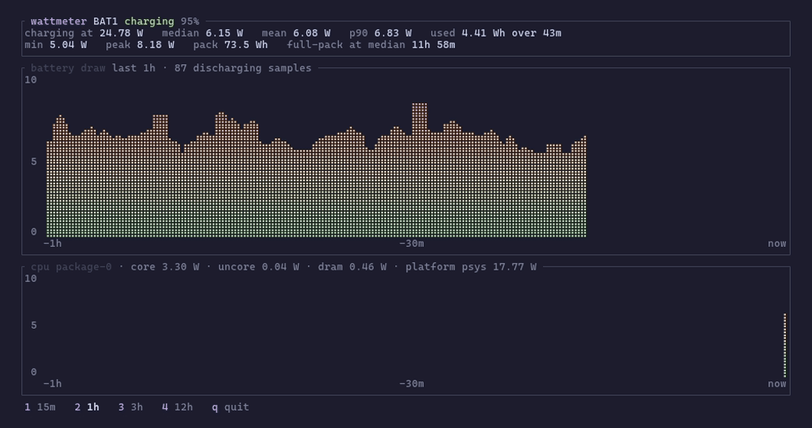

# panther-power

[](https://github.com/erwins-enkel/panther-power/actions/workflows/ci.yml)

A live terminal chart of laptop power draw, in braille. `btop`'s visual language, but for
the one number `btop` doesn't graph: watts off the battery.



That is a real recording, not a mock-up. The blank stretch mid-chart is 21 minutes on
mains: charging is not draw, so those samples are excluded rather than bridged with a
plausible-looking line. See [How it measures](#how-it-measures).

<details>
<summary>Same thing as text, for reading in a terminal</summary>

```
┌ panther-power BAT1 discharging 90% ──────────────────────────────────────────────────┐
│now 7.19 W   median 6.93 W   mean 7.65 W   p90 9.51 W                                 │
│min 2.58 W   peak 23.65 W   pack 73.5 Wh   full-pack at median 10h 37m                │
└──────────────────────────────────────────────────────────────────────────────────────┘
┌ watts last 1h · 81 discharging samples ──────────────────────────────────────────────┐
│  25  ⣀⣀                                                                              │
│     ⢰⣿⣿                                                                              │
│     ⢸⣿⣿         ⢀⣦                                                                   │
│     ⢸⣿⣿         ⢸⣿⡇                                                                  │
│     ⢸⣿⣿         ⢸⣿⡇    ⢠⣦                                                            │
│     ⢸⣿⣿         ⢸⣿⣷    ⢸⣿                                                            │
│12.5 ⢸⣿⣿         ⢸⣿⣿    ⢸⣿                                                            │
│     ⢸⣿⣿⡆        ⢸⣿⣿    ⢸⣿⣷       ⢰⣷                                                  │
│     ⢸⣿⣿⣿⣷⣤⣦⡀ ⣿⣿⣦⣸⣿⣿⣦⡀⢀⣦⣼⣿⣿⣄⣠⣀⢀⣼⣆⣀⣸⣿⣦⣄⢀⣤⣄⣿⣿⣦⣠⣤⣀                                 ⣰⣦⣸⣿⣷⣴│
│     ⢸⣿⣿⣿⣿⣿⣿⣷⣴⣿⣿⣿⣿⣿⣿⣿⣷⣾⣿⣿⣿⣿⣿⣿⣿⣿⣿⣿⣿⣿⣿⣿⣿⣿⣿⣿⣿⣿⣿⣿⣿⣿⡆                            ⣴⣶⣤⣾⣿⣿⣿⣿⣿⣿│
│     ⢸⣿⣿⣿⣿⣿⣿⣿⣿⣿⣿⣿⣿⣿⣿⣿⣿⣿⣿⣿⣿⣿⣿⣿⣿⣿⣿⣿⣿⣿⣿⣿⣿⣿⣿⣿⣿⣿⣿⣿⣿⣿⡇                            ⣿⣿⣿⣿⣿⣿⣿⣿⣿⣿│
│   0 ⢸⣿⣿⣿⣿⣿⣿⣿⣿⣿⣿⣿⣿⣿⣿⣿⣿⣿⣿⣿⣿⣿⣿⣿⣿⣿⣿⣿⣿⣿⣿⣿⣿⣿⣿⣿⣿⣿⣿⣿⣿⣿⡇                            ⣿⣿⣿⣿⣿⣿⣿⣿⣿⣿│
│     -1h                                   -30m                                    now│
└──────────────────────────────────────────────────────────────────────────────────────┘
 1 15m   2 1h   3 3h   4 12h   q quit
```

</details>

The fill runs green at idle to red at the peak, in [Catppuccin](https://catppuccin.com).

Recorded with [vhs](https://github.com/charmbracelet/vhs): `vhs docs/demo.tape`.

## Install

Linux only — it reads `/sys/class/power_supply` and talks to UPower over D-Bus.

```sh
cargo install --git https://github.com/erwins-enkel/panther-power
```

Or from a clone:

```sh
cargo build --release && ./target/release/panther-power
```

## Use

```
panther-power                       # first battery, last hour
panther-power --range 12h           # start wider
panther-power --battery BAT0        # pick a pack
panther-power --list-batteries      # what this machine exposes
```

`1` `2` `3` `4` switch between 15m / 1h / 3h / 12h. `q`, `Esc` or `ctrl-c` quits.

| Flag | Default | |
|---|---|---|
| `--battery <NAME>` | first readable | Machines with two packs chart one; the header names it |
| `--range <15m\|1h\|3h\|12h>` | `1h` | Range at startup |
| `--interval <SECS>` | `1` | See the note on resolution below |
| `--theme <latte\|frappe\|macchiato\|mocha>` | `mocha` | Catppuccin flavour |
| `--marker <braille\|half-block\|block\|dot>` | `braille` | Braille needs a font with the Braille Patterns block |
| `--color <auto\|truecolor\|ansi>` | `auto` | `auto` reads `COLORTERM`; `ansi` follows your terminal's own palette |

## Development

```sh
make ci      # fmt, clippy (warnings are errors), tests, release build — what CI runs
make run     # build and launch
make demo    # re-record docs/demo.gif, needs vhs and ttyd
```

CI invokes the same Makefile targets, so a green `make ci` locally means a green pipeline.

## How it measures

Most of the work here is in *not* lying about the data.

**Watts.** `power_now` where the firmware exposes it, otherwise
`current_now × voltage_now`. The sign is ignored — some firmware keeps `current_now`
positive while charging, so direction comes from `status`, never from the sign.

**Resolution.** The embedded controller refreshes about once a second. Polling faster
returns the same reading again rather than a new one, so 1 s is the honest floor, and the
default.

**History.** UPower already logs rate history, so the chart is populated at launch instead
of starting empty — one `GetHistory` call over the system bus, no collector daemon and no
privileges. Its `rate == 0.0` samples are artifacts around AC transitions and are dropped.

**Gaps are gaps.** UPower samples about every second under load and every thirty at rest.
Anything over two minutes breaks the line rather than interpolating across it, so a
three-hour suspend reads as absence — not as a straight line between the readings either
side of it.

**Charging is not draw.** On AC the same counters measure energy going *into* the pack.
Those samples are excluded from the chart and every statistic, and the live figure
relabels itself `charging at`. Time on AC shows up as the gap it is.

**`full-pack at median`** is what a full pack would give you at the median draw. It is a
benchmark figure and deliberately ignores the current charge level — at 50% you do not
have that long left.

Battery draw is whole-system: SoC, display, radios, everything. It is not CPU package
power, and the two should not be read as the same number.

## Known limitations

- **Run in anger on exactly one machine** (Intel Panther Lake, Arch, `BAT1`, charge-reporting
  firmware). The `power_now` branch is unit-tested but has never executed against real
  hardware. Reports from other vendors welcome.
- Machines with two packs chart one of them, not the sum.
- A sharp step between widely-spaced samples fills the earlier sample's column too tall,
  because band edges are pinned to sample positions rather than interpolated. Invisible at
  1 s live cadence; visible with 30 s backfill in the 15 m range.
- No CPU package breakdown. `intel-rapl` energy counters are root-only.

## Licence

MIT
